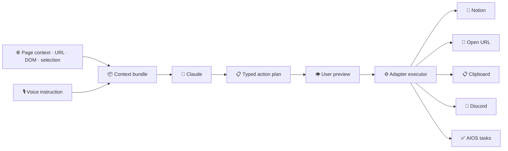

# SpellBook — Voice-to-Workflow Chrome Extension

A Chrome MV3 extension that turns what's on the current web page (plus a spoken instruction) into an executable action plan a local AI agent can run — save to Notion, open URLs, drop into the clipboard, create tasks, and more, all from a single popup.

> *This repo is a public overview. The running code is private.*

---

## What it is

Browsers are where knowledge work happens, but they don't play nicely with an assistant. SpellBook adds the missing wire: grab the page context, grab the user's voice instruction, hand both to Claude, and let Claude produce a typed action plan that gets executed by a set of pluggable adapters. Open plugin → say "save this to Notion and remind me tomorrow" → done.

## What it does

- **Captures page context** — URL, title, selected text, visible DOM content
- **Takes a spoken or typed instruction** from the popup
- **Hands context + instruction to Claude** for structured action-plan generation
- **Executes through adapters** — Notion, URL navigation, clipboard, tasks, Discord, more
- **Typed and auditable action plans** — every step is shown before it runs
- **Syncs to AIOS** — every invocation is logged to a shared local task store

## Architecture

## Software

| Layer | Tech |
|---|---|
| Extension | Chrome MV3 (TypeScript, service worker) |
| Voice input | Web Speech API |
| LLM | Anthropic Claude |
| Adapters | Notion API, clipboard, webhook relays |
| Bridge | Local webhook to AIOS (Next.js route) |

## What this demonstrates

- **Context-aware LLM tooling** — the page is the prompt, not just the user's words
- **Typed action plans** — Claude produces structured output; a deterministic executor runs it
- **Adapter pattern** — new destinations (Discord, email, Slack) drop in without touching the core
- **MV3 service-worker discipline** — clean separation of capture, planning, and execution

## Stack

## Related in the AIOS Portfolio

- **[AIOS](https://github.com/mikecutillo/aios)** — The receiver; Next.js dashboard orchestrating 16+ household and business modules
- **[AI Model Router](https://github.com/mikecutillo/ai-model-router)** — Multi-provider LLM router with waterfall fallback (Claude, OpenAI, Gemini, OpenRouter, local)
- **[Household Voice Control](https://github.com/mikecutillo/household-voice-control)** — Voice-interface layer bridging Alexa to a local AI OS via custom skill + Lambda

---

Part of the AIOS portfolio. See the [profile README](https://github.com/mikecutillo) for the full system map.
